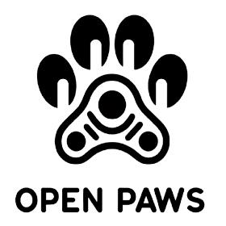

# 🐾 PawPitch - PR Intelligence Platform



## 🎥 Project Overview

**PawPitch** is an intelligent Public Relations and Pitch Generation platform designed to simplify the workflow for PR professionals. By leveraging AI-driven search and ranking, PawPitch helps users discover the most relevant journalists for their campaigns and generates personalized pitches tailored to specific beats and topics.

### 📽️ Demo Video

[](https://youtu.be/VhJd0IeZ0qE)

*Click the image above to watch the demo on YouTube.*

---

## ⚙️ How It Works

PawPitch operates through a sophisticated pipeline that transforms raw news data into actionable PR intelligence.

### **1. Data Acquisition (NewsAPI)**
When a user enters a topic (e.g., "Sustainable Fashion"), the system triggers a real-time scrape via **NewsAPI**. It fetches the latest articles, headlines, and descriptions related to the specific topic and target beat. This ensures that the intelligence is always based on the most current media landscape.

### **2. NLP Profiling (SpaCy)**
Each fetched article is processed through an **NLP (Natural Language Processing)** pipeline. Using **SpaCy**, the system:
- **Identifies Entities**: Extracts key organizations, people, and locations mentioned.
- **Analyzes Context**: Determines the depth of coverage for specific keywords.
- **Builds Profiles**: Associates these insights with the respective journalists, building a dynamic profile of what each journalist is actually writing about right now.

### **3. Intelligence Scoring & Ranking**
The core "magic" happens in the scoring engine. Each journalist receives a score out of **100 possible points**, calculated based on a composite methodology:

| Category | Points | Description |
|---|---|---|
| **Beat Alignment** | 35 / 35 | Does their current coverage beat match your campaign category (e.g., Science, Environment)? |
| **Topic Keyword Match** | 25 / 25 | How closely their recent articles mention your exact campaign topic. |
| **Article Volume** | 25 / 25 | Quantity of recent articles within the specific beat (5 pts per article, max 5). |
| **Outlet Authority** | 15 / 15 | Quality and reach of their publication (Tier-1: 15pts, Tier-2: 10pts, Niche: 5pts). |

> [!NOTE]
> **The 0-Score Filter**: If a journalist does not explicitly mention the user's specific campaign topic in their recent work, their score is automatically dropped to 0 to ensure high-accuracy matches only.

### **4. AI Pitch Prediction**
The system doesn't just find journalists; it predicts success. Using **Groq (LLama 3)**, PawPitch analyzes the journalist's historical tone and preferences to provide a "Pitch Probability" score, helping users prioritize their outreach.

### **5. Automated Pitch Generation**
Finally, the platform uses **Groq** to draft a high-conversion, personalized pitch. It incorporates the journalist's recent work into the "hook" of the email, making the outreach feel researched and authentic rather than generic.

---

## 🔑 API Configuration

To run PawPitch, you need two primary API handles. These should be placed in a `.env` file in the root directory:

| Key | Purpose | Used In |
|---|---|---|
| `NEWS_API_KEY` | Fetches real-time articles and journalist "proof of work". | `scraper.py` |
| `GROQ_API_KEY` | Powers the AI scoring, pitch prediction, and email generation. | `pitcher.py`, `predictor.py` |

---

## ✨ Key Features

- **🎯 AI-Powered Journalist Search**: Discover journalists based on specific beats and campaign topics.
- **📊 Intelligence Ranking**: AI-ranked contacts most likely to cover your topic.
- **✉️ Automated Pitch Generation**: Generate high-quality, personalized pitch drafts.
- **📈 Pitch Prediction**: proprietary AI scoring for pitch success probability.
- **📂 journalist Profiles**: Detailed profiles with topic-specific relevance breakdowns.

---

## 🏗️ Architecture

PawPitch is built with a decoupled architecture:

### **Backend (FastAPI)**
- **API Engine**: FastAPI for search and generation logic.
- **Database**: SQLModel/SQLite for data management.
- **AI Pipelines**: Groq and NewsAPI integrations.

### **Frontend (React + Vite)**
- **UI Framework**: React with Vite.
- **Styling**: Tailwind CSS for a premium, modern design.
- **Icons**: Lucide-React.

---

## 🛠️ Tech Stack

### **Backend**
- **Language**: Python 3.x
- **Framework**: [FastAPI](https://fastapi.tiangolo.com/)
- **AI/NLP**: [Groq (Llama 3)](https://groq.com/), [SpaCy](https://spacy.io/), [NewsAPI](https://newsapi.org/)
- **ORM/DB**: [SQLModel](https://sqlmodel.tiangolo.com/)

### **Frontend**
- **Framework**: [React](https://reactjs.org/)
- **Build Tool**: [Vite](https://vitejs.dev/)
- **Styling**: [Tailwind CSS](https://tailwindcss.com/)

---

## 🚀 Getting Started

### **Prerequisites**
- Python 3.9+ | Node.js 18+
- [NewsAPI Key](https://newsapi.org/register)
- [Groq API Key](https://console.groq.com/keys)

### **1. Setup Backend**
```bash
cd backend
python3 -m venv venv
source venv/bin/activate
pip install -r requirements.txt
# Create .env in root with NEWS_API_KEY and GROQ_API_KEY
python3 main.py
```

### **2. Setup Frontend**
```bash
cd frontend
npm install
npm run dev
```

---

## 📄 License

Internship project development. All rights reserved.
